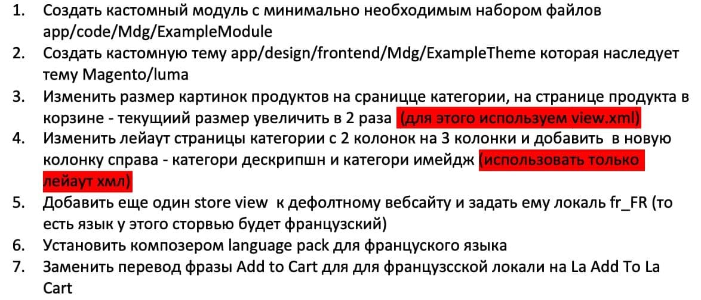

Second Task

* 1)&check;
* [2) Mdg/ExampleThem](../../../design/frontend/Mgd/ExampleThem/registration.php)&check;
* [3)Создаём файл view.xml, где прописываем расширение для картинок](../../../design/frontend/Mgd/ExampleThem/etc/view.xml)&check;
* [4)Создаём catalog_category_view.xml, прописываем layout="3columns", меняя layout на три колонки, и проводим ред move для корректного отображения как в таске](../../../design/frontend/Mgd/ExampleThem/Magento_Theme/layout/catalog_category_view.xml)&check;
* [5,6)Загружаем языковой пакет, создаём в админке новый store view, в котором устанавливаем новый язык](https://www.mageplaza.com/magento-2-french-language-pack.html) &check;
* [7)Создаём папку i18n, в которой файл  fr_FR.csv, и прописываем свой перевод](../../../design/frontend/Mgd/ExampleThem/i18n/fr_FR.csv) &check;
