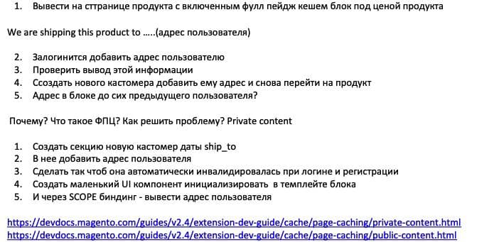

Seventh Task

* 1)[Создадим   Section Source для обработки запроса, логика описывается в методе 
getSectionData](./CustomerData/CustomerPrivetInfo.php)
* 2)[Добавим валидацию к нашей секции](./etc/frontend/sections.xml)  
* 2)[В etc/frontend/di.xml так сказать зарегистрируем нашу новорождённую секцию](./etc/frontend/di.xml)
* 3)[Создадим layout, в котором в нужную нам секцию страницы добавим новый блок](./view/frontend/layout/catalog_product_view.xml)
* 4)[Добавим template файлик для нашего блока, в котором мы привяжем данные и вызовем наш js](./view/frontend/templates/custom_section.phtml)
* 5)[Осталось только  создать js который будет получать наши данные ](./view/frontend/web/js/section.js)
