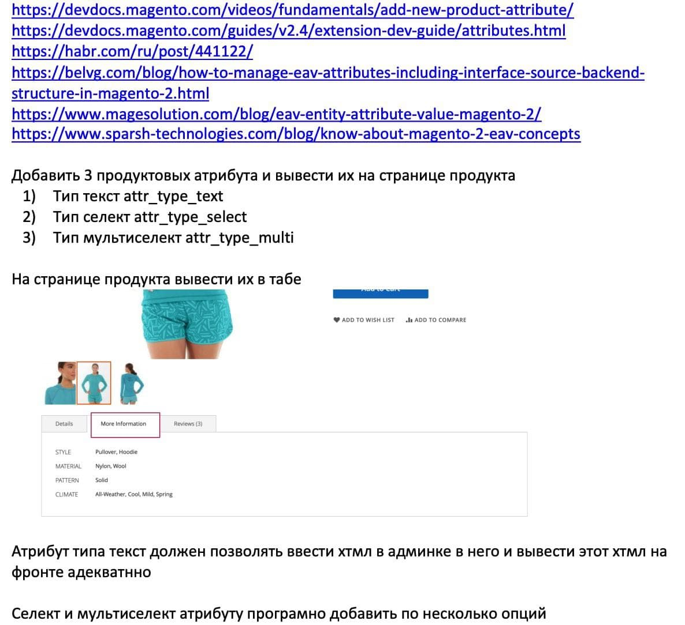

Third Task

Для добавления атрибутов будет использовать классы, которые будут  implements DataPatchInterface, для каждого реализуем свой класс, со своей структурой  
* [1) Тип текста attr_type_text](Setup/Patch/Data/AttrTypeText.php)
* [2) Тип текста  attr_type_select](Setup/Patch/Data/AttrTypeSelect.php)
* [2) Тип текста  attr_type_multiselect](Setup/Patch/Data/AttrTypeMultiselect.php)
    * [2.1) Создадим class который будет предоставлять нам данные для Multiselect](Model/Config/Multiselect/GetDateForMultiselectAttribute.php)

